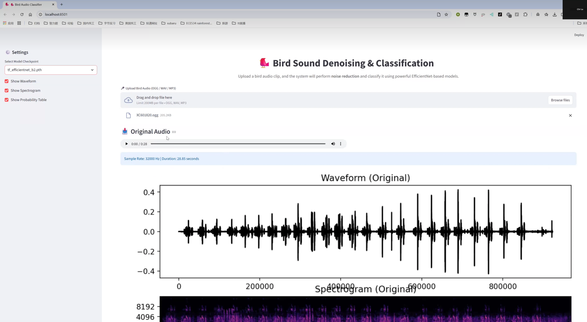

# 🐦 Bird Sound Denoising & Classification Web App

A modern, interactive **Streamlit web application** for **bird audio noise reduction** and **species classification**, powered by EfficientNet models and advanced signal processing techniques.

This app allows users to upload a bird audio clip, apply high-quality noise reduction, visualize waveforms and spectrograms, and classify the bird species using a deep learning model.

🎥 **Demo Video:**  
https://www.youtube.com/watch?v=vpLIx6iSDYs  

---

## 📸 App Screenshot

---

## 🚀 Features

### 🔉 **1. High-Quality Noise Reduction**
- Band-pass filtering (1–8 kHz)
- Spectral noise gating using *noisereduce*
- Clearer and more recognizable bird calls after processing
- Immediate playback of the denoised audio

---

### 🧠 **2. EfficientNet-Based Bird Species Classification**
- Converts audio into mel–spectrograms
- Supports multiple model checkpoints (`.pth`)  
- Automatically loads new models dropped into the `models/` folder  
- Provides:
  - Predicted species  
  - Confidence score  
  - Full probability distribution (optional)

---

### 📊 **3. Visualization Tools**
- Waveform visualization (before & after noise reduction)
- Spectrogram visualization  
- Probability distribution table

---

### 🖥️ **4. Clean, Modern UI**
- Fully English interface  
- Two-step workflow:
  1. **Noise Reduction**
  2. **Classification**
- Built using Streamlit with a clean wide-layout design

---

## 🧩 Project Structure

